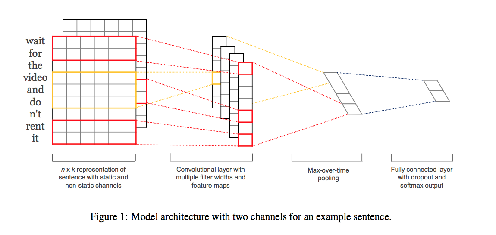

# CNN for Text Classification

A PyTorch CNN for classifying the sentiment of movie reviews, based on the paper [Convolutional Neural Networks for Sentence Classification](https://arxiv.org/abs/1408.5882) by Yoon Kim (2014).

The task of text classification has typically been done with an RNN, which accepts a sequence of words as input and has a hidden state that is dependent on that sequence and acts as a kind of memory. This example shows how you can utilize convolutional layers to find patterns in sequences of word embeddings and create an effective text classifier using a CNN-based approach!



*Image from the original paper, [Convolutional Neural Networks for Sentence Classification](https://arxiv.org/abs/1408.5882).*

If you'd like to work with this code locally, you may follow the instructions (as needed) below! These installation instructions assume you have installed miniconda, but if you have not, you can download the latest version [here](https://conda.io/en/latest/miniconda.html).

---

## Create and Activate the Environment

For Windows users, these following commands need to be executed from the **Anaconda prompt** as opposed to a Windows terminal window. For Mac, a normal terminal window will work. 

#### Git and version control
These instructions also assume you have `git` installed for working with Github from a terminal window, but if you do not, you can download that first with the command:
```
conda install git
```

**Now, we're ready to create a local environment!**

1. Clone the repository, and navigate to the downloaded folder. This may take a minute or two to clone due to the included image data.
```
git clone https://github.com/cezannec/CNN_Text_Classification.git
cd CNN_Text_Classification
```

2. Create (and activate) a new environment, named `classification-env` with Python 3. If prompted to proceed with the install `(Proceed [y]/n)` type y.

	- __Linux__ or __Mac__: 
	```
	conda create -n classification-env python=3
	source activate classification-env
	```
	- __Windows__: 
	```
	conda create --name classification-env python=3
	activate classification-env
	```
	
	At this point your command line should look something like: `(classification-env) <User>:CNN_Text_Classification <user>$`. The `(classification-env)` indicates that your environment has been activated, and you can proceed with further package installations.

3. Install PyTorch and torchvision; this should install the latest version of PyTorch.
	
	- __Linux__ or __Mac__: 
	```
	conda install pytorch torchvision -c pytorch 
	```
	- __Windows__: 
	```
	conda install pytorch -c pytorch
	pip install torchvision
	```

6. Install a few required pip packages, which are specified in the requirements text file (including gensim).
```
pip install -r requirements.txt
```

7. That's it!

Now all of the `classification-env` libraries are available to you. Assuming your `classification-env` environment is still activated, you can navigate to the main repo and start looking at the notebooks:

```
cd
cd CNN_Text_Classification
jupyter notebook
```

To exit the environment when you have completed your work session, simply close the terminal window.
